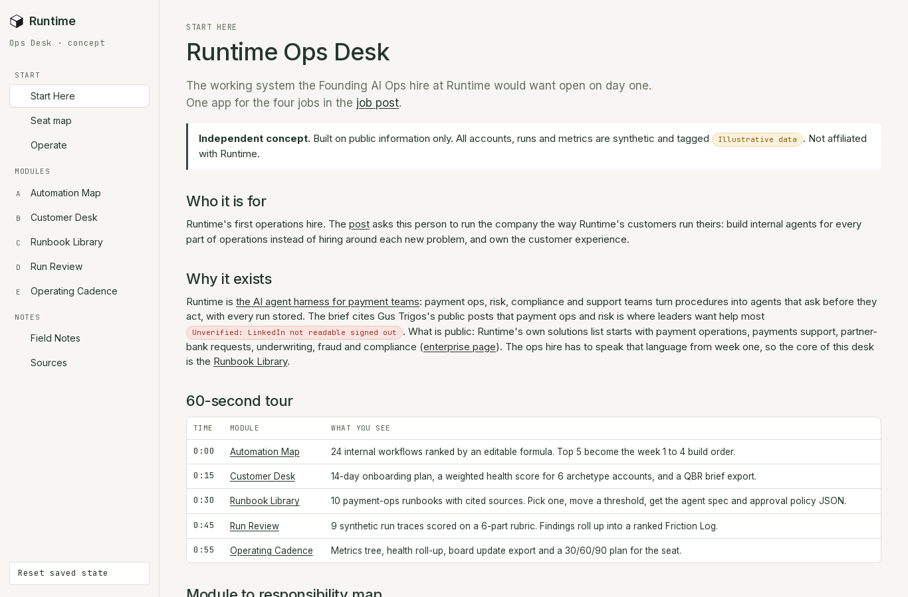
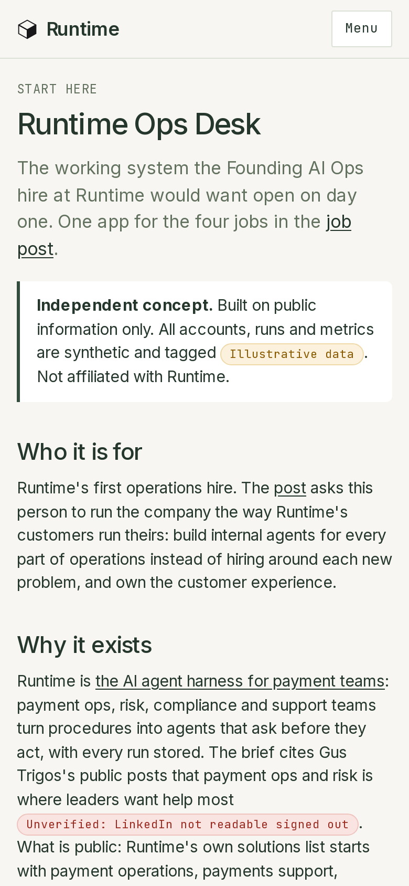
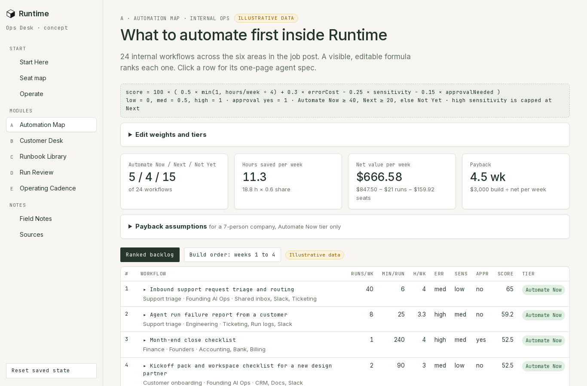
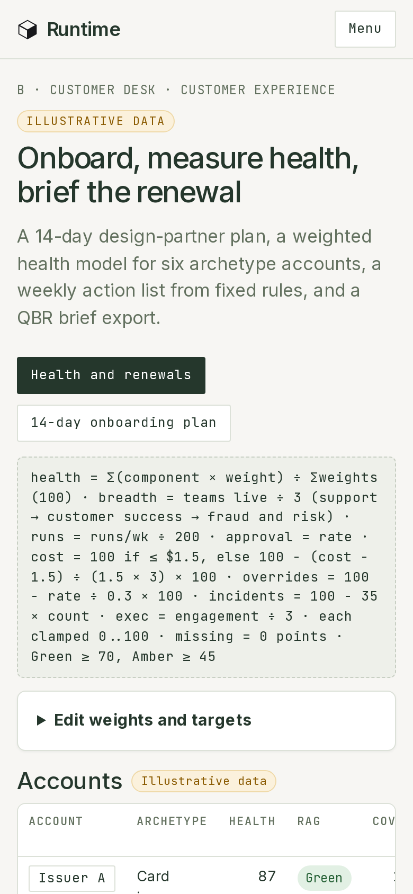

# Visual guide

- Left rail on desktop, menu button at 390 px. Mark + "Runtime" wordmark top left, as on runtm.com.
- Each module opens with an eyebrow (module letter and job), a headline, a one-line lede, then the formula block.
- Tags: green Sourced, grey Assumption, grey Placeholder, amber Illustrative data, red Unverified.
- Tables scroll sideways inside their panel on mobile; the page itself never scrolls sideways.
- Footer on every page: "Independent concept by Ayo Ahmed. Public information only. Not a Runtime product."

| Desktop | Mobile |
| --- | --- |
|  |  |
|  |  |
